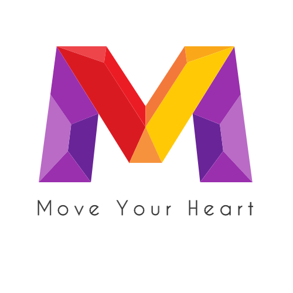

# Move Your Heart

## Table of Contents

- [Move Your Heart](#move-your-heart)
  - [Table of Contents](#table-of-contents)
  - [About The Project](#about-the-project)
    - [Built With](#built-with)
  - [Getting Started](#getting-started)
    - [Prerequisites](#prerequisites)
    - [Installation](#installation)
  - [Usage](#usage)
  - [Contact](#contact)

 
 

## About The Project

 

**무브유어하트**

- 예술 심리치유센터 무브유어하트의 회사 소개 랜딩페이지입니다.

**기술 스택**

- Media Query를 활용하여 반응형 홈페이지
- 리액트로 이미지 슬라이딩 기능 구현하였습니다.
- 스크롤에 따라 헤더 상태가 변화하는 이벤트를 적용하였습니다.

**사이트 방문하기**
https://www.moveurheart.com/

 
 

### Built With

- [React JS](https://ko.reactjs.org/)

 
 

## Getting Started

### Prerequisites

노드 패키지 매니저 설치

<pre>
<code>
npm install npm@latest -g
</code>
</pre>

### Installation

1. Repo 클론

   <pre>
   <code>
   git clone https://github.com/Kylekoh/MoveURHeart.git
   </code>
   </pre>

2. NPM 패키지 설치

   <pre>
   <code>
   npm install
   yarn add
   </code>
   </pre>

3. 프로젝트 시작
   <pre>
   <code>
   npm start
   yarn start
   </code>
   </pre>

 
 

## Usage

- 랜딩페이지 전체화면
   
  
   

- 랜딩페이지 모바일버전
   
  

 

## Contact

<ykoh728@gmail.com>
